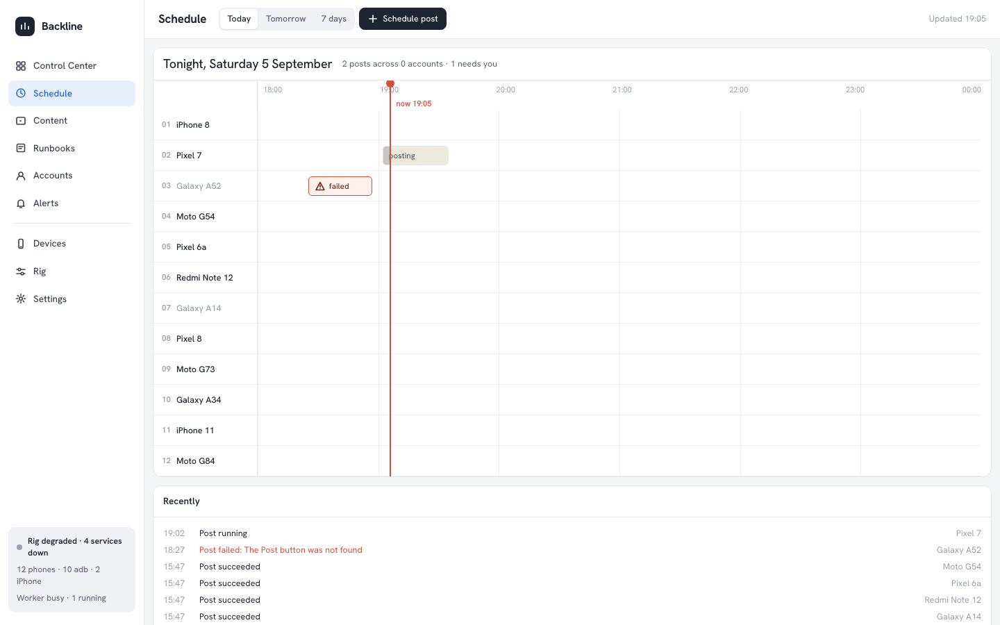

# Backline

Backline is an open-source, self-hosted application for operating a rack of
physical phones — **iPhones over WebDriverAgent and Android phones over adb or an
on-device accessibility bridge** — from one local control center. It gives you
guided device registration for both platforms, a live screen with remote
tap/swipe, a PostgreSQL-backed scheduler that runs versioned automation tasks (a
TikTok plugin ships built in, with an iOS and an Android routine), a content
library that normalises clips with FFmpeg and drips them out as scheduled posts,
tags, bulk actions, an event timeline and alerts over
webhook/Slack/Discord/ntfy, an MCP server so an agent can drive the farm, a macOS
desktop app that supervises every process for you, and an Expo companion app for
watching and steering the farm from your own phone.

## The pages

| Page | What it answers |
| --- | --- |
| **Control Center** (`/`) | *What is happening.* Every phone's screen, live, numbered and selectable. Batch actions act on the selection; clicking a tile opens the viewer with hardware controls and the running task's log. |
| **Schedule** (`/schedule`) | *What happens tonight.* One track per phone, one clip per post, coloured by the account that owns it, with a playhead at now. A red clip needs you; a dashed one is the retry already booked. Click a clip to stop, retry, pause, skip or open the phone. |
| **Content** (`/content`) | The media library, the sets and caption templates, and the drip rules that turn tagged media into scheduled posts. |
| **Runbooks** (`/runbooks`) | Sequences recorded once on one phone and replayed on the fleet. |
| **Rig** (`/rig`) | The services under the farm — Postgres, Appium, the WDA supervisor, the worker — and their live logs. |

Accounts, Alerts, Devices and Settings sit alongside them in the same shell.



It runs locally as-is; authentication is optional on a loopback bind. Harden it
for a shared or exposed deployment with the built-in `local` auth provider or
your own `AuthProvider` (`PHONE_FARM_AUTH_PLUGIN`) — no fork required. Tasks are
persisted as `pluginId`, `taskType`, `taskVersion` and a JSON payload, so an old
schedule can never silently execute a new contract.

## Which way to run it

There are two supported ways to run the same code. Pick one.

### 1. The desktop app (recommended)

The desktop app (`apps/desktop`) is a macOS Electron supervisor. It starts and
restarts PostgreSQL (bundled, or yours), the migrations, `adb`, Appium, the WDA
service, the worker and the web server, keeps a rotating log per service, and
opens the real dashboard in its own window. No terminal, no Docker, no `.env`.

```sh
npm install
npm --prefix apps/desktop install
npm run desktop:dev        # run it against this checkout
npm run desktop:build      # build the .app / .dmg into apps/desktop/release/
```

Settings live in `~/Library/Application Support/Backline/settings.json` — the
app does **not** read `.env`. Full details, including what is bundled and where
the data lives: [docs/desktop.md](docs/desktop.md).

The push relay and the MCP stdio server are not supervised by the app; start
those by hand if you want them.

### 2. Manual processes

One long-lived process per terminal, or one `launchd` agent / systemd unit each.
This is the right shape for a headless always-on host and for development.

```sh
npm install
cp .env.example .env
npm run db:up          # bundled Postgres via docker compose (skip if you run your own)
npm run db:migrate

npm run web            # dashboard + JSON API + MCP over HTTP, on :3000
npm run worker         # scheduler worker — runs due tasks
npm run appium         # iOS only: Appium 3 + XCUITest on :4725
npm run wda:service    # iOS only: per-device WebDriverAgent supervisor
npm run push:relay     # optional: Expo push for the companion app
npm run mcp            # optional: the MCP server over stdio
```

An Android-only farm needs only `web` and `worker` (plus `adb` on `PATH`).

## Requirements

| | Every install | Android phones | iPhones |
| --- | --- | --- | --- |
| Host | macOS or Linux for Android-only; **macOS for iOS** | — | macOS |
| Runtime | Node.js 22+ (`engines.node >= 22`) | — | — |
| Database | PostgreSQL 14+ (`docker compose up -d postgres`, your own, or the desktop app's bundled 17) | — | — |
| Device tooling | — | **`adb` only** (Android platform-tools on `PATH`) | Full Xcode, an Apple Developer team for signing, and Appium's XCUITest driver (`npm run appium:install-driver`) |
| On the phone | — | Developer options → USB debugging; optionally the accessibility-bridge APK for cable-free operation | Paired + trusted, Developer Mode on iOS 16+, WebDriverAgent built and signed (`npm run wda:prepare`) |
| Optional | FFmpeg (bundled static builds are used as a fallback), `yt-dlp` for URL ingest | — | — |

There is no build step for the server: it runs TypeScript directly through `tsx`.

Android needs no Xcode, no signing, no Apple ID and no provisioning profile. If
you only have Android phones, set `ANDROID_DISCOVERY=on` (the default), skip
every Xcode step, and never run `appium` or `wda:service`.

## Documentation

**Start here**

- [docs/getting-started.md](docs/getting-started.md) — install, configure, run, register your first device (Android and iOS paths)
- [docs/device-testing-checklist.md](docs/device-testing-checklist.md) — the step-by-step checklist for your first session with real hardware
- [docs/operations.md](docs/operations.md) — running it day to day: the Control Center and Schedule loop, the drip queue, alerts, tokens, backups, upgrades, logs
- [docs/architecture.md](docs/architecture.md) — the processes, data stores, task model, source map
- [docs/design/backline.md](docs/design/backline.md) — the design system every surface is built from: tokens, components, copy

**Subsystems**

- [docs/desktop.md](docs/desktop.md) — the macOS desktop app: services, settings, packaging, diagnostics
- [docs/content-queue.md](docs/content-queue.md) — content library, FFmpeg normalisation, and the drip queue
- [docs/fleet-and-alerts.md](docs/fleet-and-alerts.md) — the `/fleet` page, the event timeline, notification channels, the daily digest
- [docs/push-relay.md](docs/push-relay.md) — turning events into Expo push notifications
- [docs/mcp.md](docs/mcp.md) — the MCP server: stdio and HTTP transports, tool list, security notes
- [docs/mobile-api.md](docs/mobile-api.md) — the JSON API contract the companion app codes against
- [docs/mobile-app.md](docs/mobile-app.md) — the companion phone app: demo mode, Tailscale, push, EAS builds
- [docs/runbooks.md](docs/runbooks.md) — the built-in runbook plugin

**Devices**

- [docs/android-dashboard.md](docs/android-dashboard.md) — registering an Android phone from the dashboard
- [docs/android-tiktok.md](docs/android-tiktok.md) — the Android TikTok routines, phone-side prerequisites, selector table
- [docs/coordinates.md](docs/coordinates.md) — iOS tap-layout profiles and how to add one
- [docs/motion.md](docs/motion.md) — human swipe arcs, pause distributions, per-device handedness, run jitter
- [src/drivers/README.md](src/drivers/README.md) — the `DeviceDriver` interface and the three control channels
- [docs/adr/0001-multi-platform-device-drivers.md](docs/adr/0001-multi-platform-device-drivers.md) — why the driver layer looks like this

**Extending and securing it**

- [docs/plugins.md](docs/plugins.md) — write a plugin: tasks, execution context, versioning, panels, routes
- [PLUGIN_DEVELOPMENT.md](PLUGIN_DEVELOPMENT.md) — plugin trust and compatibility rules
- [docs/auth.md](docs/auth.md) — the built-in `PHONE_FARM_AUTH_PLUGIN=local` login and API tokens
- [SECURITY.md](SECURITY.md) — before exposing the dashboard beyond loopback

## Plugin contract

`src/plugin.ts` defines the stable interfaces. A plugin can provide versioned
tasks, registration checks, device-page panels, namespaced HTTP routes, and
declared WDA extensions. Task execution receives the exact device, that plugin's
own per-device data, a `DeviceDriver` for whichever platform the device is,
resolved assets, a temporary workspace, cancellation, durable logging, safe
device primitives, and an observed subprocess runner.

TikTok and runbook support are enabled by default. Set `PHONE_FARM_PLUGINS` to
comma-separated ESM package names to add more. Set `PHONE_FARM_AUTH_PLUGIN`
before binding `WEB_HOST` outside loopback; startup deliberately fails otherwise.

See `PLUGIN_DEVELOPMENT.md` for compatibility and trust rules.
`src/example-plugin.ts` is a minimal open-app plugin. Production plugins should
be separate packages and should never require changes to core routing or
scheduler code.

## Repository policy

This repository uses GitHub-hosted CI only. Never connect production devices,
Apple signing material, production databases, self-hosted runners, or deployment
credentials to workflows triggered by pull requests. See `SECURITY.md`.

```sh
npm run check                       # typecheck + tests for the farm
npm --prefix apps/desktop run check # the desktop app
npm run mobile:test                 # the companion app
```
