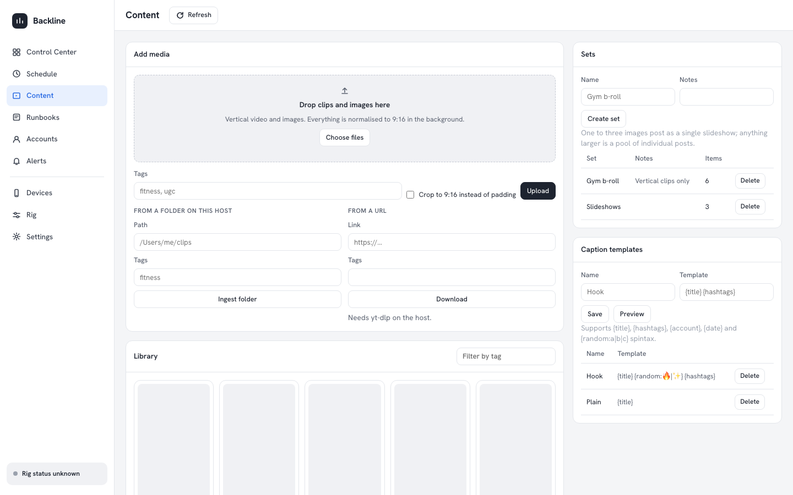

# Content library and drip queue

The `/content` page turns a folder of raw clips into a queue of scheduled TikTok
posts. It does three things:



1. **Ingest and normalise** — every upload is probed, and video is transcoded to
   a TikTok-safe copy (9:16, H.264 + AAC, ≤ 1080×1920, ≤ 180 s, metadata
   stripped, `faststart`). The original is kept untouched.
2. **Organise** — items carry tags, a title/caption seed and hashtags. Sets group
   items; caption templates render the text each post uses.
3. **Drip** — a rule says "two posts a day for `@handle` on this phone, between
   09:00 and 21:00 local, at least two hours apart, from the `fitness` tag". A
   planner turns that into ordinary one-off schedules through the existing
   scheduler, so everything the Schedule page can do to a schedule still works.

## Requirements

FFmpeg. `ffmpeg` and `ffprobe` are used from `PATH` when present; otherwise the
bundled `ffmpeg-static` / `ffprobe-static` binaries are used. Point at specific
binaries with `FFMPEG_PATH` and `FFPROBE_PATH`. Ingest fails with a clear message
when neither is available — nothing else in the app is affected.

`yt-dlp` is optional. `POST /api/content/ingest-url` answers `501` with an
explanation when it is not on `PATH` (or at `YT_DLP_PATH`).

Every external tool is executed with `execFile` and an argument array. No path,
filename or URL is ever passed through a shell.

## Environment

| Variable | Default | Meaning |
| --- | --- | --- |
| `CONTENT_DIR` | `$SCHEDULER_DATA_DIR/content` | Originals, normalised copies, posters, and per-post links. |
| `DRIP_PLANNER_INTERVAL_MINUTES` | `60` | How often the web process **and the worker** plan. `0` disables the tick in both; `POST /api/drip/plan` still works. |
| `CONTENT_CONCURRENCY` | `2` | Concurrent FFmpeg jobs. |
| `FFMPEG_PATH`, `FFPROBE_PATH` | — | Explicit binaries instead of `PATH`. |
| `YT_DLP_PATH` | — | Explicit `yt-dlp` binary. |

Keep `CONTENT_DIR` inside `SCHEDULER_DATA_DIR` unless you have a reason not to:
the scheduler's own asset purge only reaches paths under the data root.

## How ingest works

`POST /api/content/items` (multipart, field `media`) or
`POST /api/content/ingest { directory }` writes the source into
`CONTENT_DIR/originals`, registers it as an asset, and creates a
`content_items` row with status `processing`. The FFmpeg work then runs
in-process behind a two-slot limiter:

- **video** → `CONTENT_DIR/normalized/<uuid>.mp4`, registered as a second asset;
  the item points at that copy while `original_asset_id` keeps the source.
  9:16 is reached by padding; pass `crop: true` to fill and lose the edges.
- **image** → used as-is.
- both get a poster frame in `CONTENT_DIR/posters/<item id>.jpg`, served from
  `GET /api/content/items/:id/poster`. The library grid draws the shared asset
  thumbnail instead (`GET /api/assets/:id/thumbnail`), so one cache serves the
  dashboard and the companion app.

The row ends at `ready`, or at `failed` with the FFmpeg message in `error`.

## Caption templates

Deliberately tiny, and fully covered by tests:

```
{title} {random:🔥|✨|💪} {hashtags}
```

`{title}`, `{hashtags}`, `{account}` and `{date}` substitute; `{random:a|b|c}`
picks one branch. An unknown `{token}` is left in place so a typo is visible
rather than silently blank. `POST /api/content/templates/preview` renders one
without saving it.

## The drip planner

### Who ticks, and the lock

Both `npm run web` and `npm run worker` start the same tick
(`startDripPlannerTick` in `src/content/runner.ts`), every
`DRIP_PLANNER_INTERVAL_MINUTES`. A worker-only deployment therefore still plans
its queue, and a farm running several web replicas alongside a worker does not
plan several times.

What makes that safe is a Postgres advisory lock. Every planning run — the tick
in any process, and `POST /api/drip/plan` — goes through `runDripPlanner`, which
opens a transaction and takes `pg_try_advisory_xact_lock` on one fixed key
(`DRIP_PLANNER_LOCK_KEY`). `try` means a second run is **refused, not queued**:
it plans nothing and comes back with `Another planning run is already in
progress` in `skipped`. The lock covers planning *and* the `used_count`
reconciliation, and is held by the transaction, so a planner whose process dies
releases it when the connection drops rather than wedging the farm.

Every tick (and on `POST /api/drip/plan`), for each enabled rule and for today
and tomorrow **in the rule's own timezone**:

- skip the date if `drip_plans` already has rows for it — a re-run plans nothing
  twice, so the hourly tick and a manual run converge;
- pick `posts_per_day` items that have not been used within `avoid_reuse_days`,
  ordered `random` or `fifo` (never-used first, then least recently used);
- choose random times inside the window, at least `min_gap_minutes` apart, never
  in the past — times are drawn, sorted, and spread across whatever slack the
  window has left once every mandatory gap is reserved, so a tight window plans
  fewer posts rather than illegal ones;
- render the caption and create a `once` schedule via the normal
  `repository.createTask` with the TikTok `post` payload;
- record each `(rule, date, schedule, item)` in `drip_plans`.

A set of one to three images is planned as a single slideshow post; a larger set
is a pool of individual posts.

Disabling a rule cancels the schedules it planned that have not started yet.

**Editing a planning-relevant field does the same and re-plans.** `PATCH
/api/drip/rules/:id` compares the row before and after; if any of `deviceUdid`,
`account`, `postsPerDay`, `windowStart`, `windowEnd`, `timezone`,
`minGapMinutes`, `destination`, `source`, `setId`, `tag`, `captionTemplateId`,
`pickOrder` or `avoidReuseDays` changed, the rule's unrun posts are cancelled
and their `drip_plans` rows deleted, so the next pass rebuilds today's queue
from the new settings. The response carries `replanned: { cancelled, released }`.
Editing anything else (the `enabled` flag aside) leaves the queue alone. A post
that has already started is never touched — an edit reaches the future, not a
run in flight.

### Reading `skipped`

The report is `{ rulesConsidered, planned, cancelled, skipped }`, and `skipped`
is where an unattended farm says what it could not do. Lines to watch for:

- `<rule>: no unused content matches this rule` — everything in the tag or set
  is inside `avoid_reuse_days`, or nothing is `ready`.
- `<rule>: ran out of unused content on <date> after 2 of 3 posts` — the
  **shortfall report**. The day was planned short. Silently under-posting for
  weeks is the failure mode a drip queue actually has, so a partial day is
  always named, with the count it managed against the count it wanted.
- `<rule>: device <udid> is not registered or is disabled` — the rule points at
  a phone that is gone.
- `<rule>: "<zone>" is not a time zone this host knows` — a restored dump or a
  hand-edited row; the other rules still plan.
- `Another planning run is already in progress` — another process held the
  advisory lock. Nothing is wrong; the run that held it did the work.

`used_count` and `last_used_at` are only credited once an execution actually
**succeeded** — the planner polls the executions table rather than hooking the
worker.

### Notes on the post payload

- The timing is always `once`, so `recurringPublishConfirmed` is never needed:
  the plugin only demands it for `daily`/`weekly` publish schedules.
- The scheduler deletes a one-off schedule's assets when it succeeds. A planned
  post therefore gets its **own** assets row backed by a hard link to the same
  bytes; the purge unlinks that copy and the library master survives. For the
  same reason the orphan-asset sweep skips assets a `content_items` row
  references.
- Rules validate the device and account at plan time: an unregistered or
  disabled device is reported in the run's `skipped` list, not scheduled.

## API

| Route | Purpose |
| --- | --- |
| `GET /content` | The page: ingest, the library grid, sets, caption templates and the drip rules. |
| `GET/POST /api/content/items` | List, or upload multipart media. |
| `PATCH/DELETE /api/content/items/:id` | Edit tags/caption/hashtags/status, or delete with its files. |
| `GET /api/content/items/:id/poster` | Poster frame. |
| `POST /api/content/ingest` | `{ directory, tags?, crop? }`. |
| `POST /api/content/ingest-url` | `{ url, tags?, crop? }` — needs `yt-dlp`. |
| `GET/POST /api/content/sets`, `DELETE /api/content/sets/:id`, `PUT /api/content/sets/:id/items` | Sets and membership. |
| `GET/POST /api/content/templates`, `DELETE …/:id`, `POST …/preview` | Caption templates. |
| `GET/POST /api/drip/rules`, `PATCH/DELETE /api/drip/rules/:id` | Drip rules. |
| `GET /api/drip/plans`, `POST /api/drip/plan` | What is planned, and plan now. |

Every request body is read through an explicit whitelist; anything not named is
dropped rather than persisted.

## Tables

`content_items`, `content_sets`, `content_set_items`, `caption_templates`,
`drip_rules`, `drip_plans` — all in the `scheduler` Postgres schema, defined in
`src/database/schema-content.ts` and created by `drizzle/0002_content.sql`.
