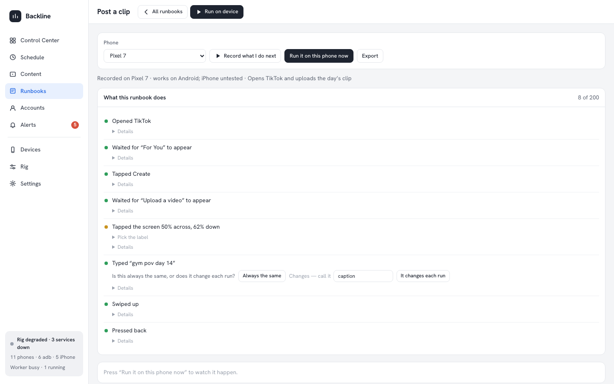
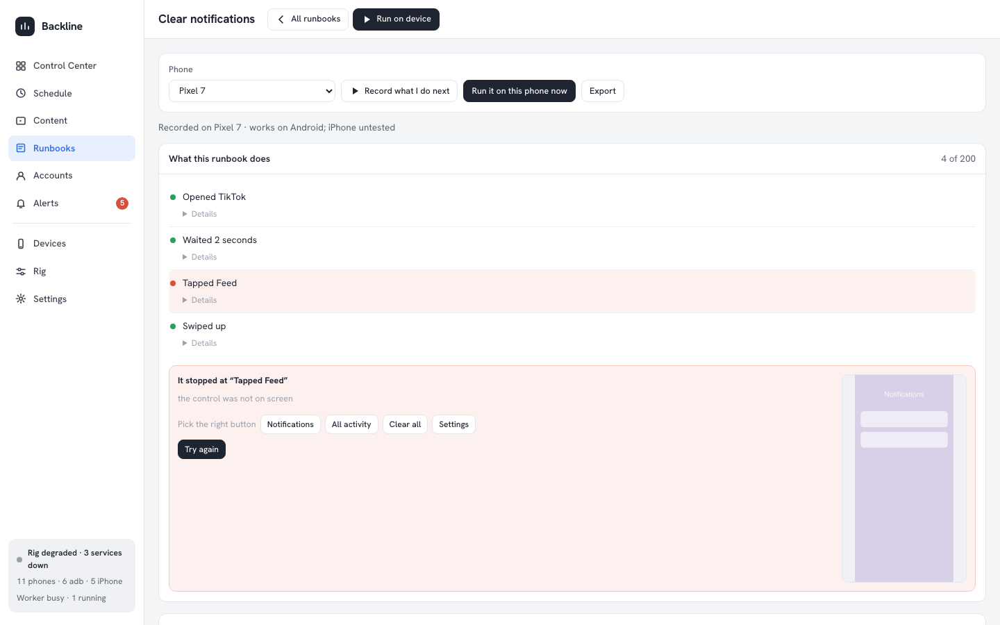

# Runbooks — record once, replay on the fleet

A **runbook** is a recording of what you did on one phone, replayed on any registered device. You
press record, do the thing once, and give it a name. That is the whole of it: there is no step
type to choose, no timeout to guess, no retry count to set and no brace to type.

Where the commercial farms replay pixels, this one replays **intent**: every recorded tap keeps the
accessibility identity of the control it hit, and replay looks that control up again on the target
device. The recorded screen position is only the last resort.

## Making one, in under two minutes

1. **Press record.** On the Control Center, select a phone and press **Record what I do next** in
   the inspector; or open the phone's own page and press the same button in the **Runbooks** panel.
   The runbook is created for you, under a placeholder name, and a red **Recording** bar appears.
2. **Drive the phone.** Click to tap, drag to swipe, type into the text box, press the hardware
   buttons. Every action is written down.
3. **Watch it narrate.** Beside the phone, each action arrives as a sentence — *Opened TikTok*,
   *Tapped Create*, *Swiped up*, *Typed the caption*, *Pressed back*. Each line carries a dot:
   green when the control was captured by its identifier or its label, amber when only the
   position was caught. An amber line offers **Pick the label**, which lists the texts that were on
   that screen at that moment; one click makes the step replay anywhere.
4. **Press Done.** You are asked for a name, and optionally one line about what it is for. Nothing
   else: the phone type is a fact about the recording — *Recorded on Pixel 7 · works on Android;
   iPhone untested* — not a question.



### Waits appear by themselves

While recording, the screen is read before and after every action. When it materially changed —
new, distinct texts appeared — the recorder puts a wait in front of whatever you do next, narrated
as *Waited for "Upload a video" to appear*. That is the pause you sat through, written down as
something the replay can check, rather than a sleep somebody guessed at.

### Blanks instead of variables

After recording, every typed line asks one question, inline: **is this always the same, or does it
change each run?** "Always the same" answers it for good. "It changes each run" turns the line into
a named blank, and every run of that runbook offers a field for it, with the last answer already
filled in. `{{name}}` is only how a blank is stored; nobody has to type it.

### Try it now

**Run it on this phone now** replays the runbook on the recording phone immediately, in process —
no queue, no worker. The phone's live screen sits beside the sentences, and each one lights up as
it runs. If a step cannot be found, the run stops at that sentence and says what the screen showed.

### Fix on failure

A failed run leaves a repair panel on the runbook's page: the sentence that gave up, the reason,
the screenshot the replay took at that moment, and **Pick the right button** over the texts that
were actually on screen. Choose one and press **Try again**. The failed execution's alert and the
device's activity block both carry a **Fix it** link straight to it.



### The raw steps

Everything above is a view of the same engine, and the engine is still reachable: **The raw steps**
on the runbook's page opens the step table, with types, retries, timeouts and the optional flag.
Every sentence also has a **Details** disclosure holding its step JSON. Nobody has to look, and
nothing is hidden from whoever wants to.

### Moving one between farms

**Export** downloads a runbook as a `.json` file; **Import a file** on the Runbooks page reads one
back. An imported file is validated field by field like any other body, and lands under a fresh id
— importing never overwrites what is already there.

## Concepts

A runbook is a JSON document under `SCHEDULER_DATA_DIR/runbooks/<id>.json` — no database, no
migration. Copy one between farms with `scp`.

```jsonc
{
  "id": "rb-8fj2k1a9x0z1",
  "name": "Warm up feed",
  "description": "Open the app and scroll a little",
  "platform": "android",          // "ios" | "android" | "any"
  "appId": "com.zhiliaoapp.musically",
  "createdFor": { "udid": "R58N12ABCDE", "screen": { "width": 1080, "height": 2400, "scale": 1 } },
  "version": 1,
  "steps": [ /* … */ ]
}
```

### Steps

| Step | Fields | Notes |
| --- | --- | --- |
| `launchApp` | `appId` | Bundle id on iOS, package name on Android |
| `tap` | `target` | See *Targets* below |
| `swipe` | `from`, `to`, `durationMs` | Points are fractions (0–1) of the screen |
| `type` | `text` | Holds `{{name}}` blanks; the page asks about them for you |
| `key` | `key` | `home`, `back`, `recents`, `power`, `enter`, `delete`. iOS has no `back` or `recents` |
| `wait` | `ms` | Plain sleep; aborts promptly when the execution is stopped |
| `waitForText` | `text` or `id`, `timeoutMs` | Polls the accessibility tree |
| `assert` | `text` or `id`, `expect: present\|absent` | Fails the run when the screen disagrees |
| `screenshot` | `label` | Captured into the execution log |

Every step also takes `retries` (0–10), `retryDelayMs`, and `optional` — none of which the
recording flow shows anyone. An **optional** step that
keeps failing is logged and skipped instead of failing the run — the right setting for cookie
banners, "rate this app" prompts and other things that only sometimes appear.

### Targets

A tap target is `{ id?, text?, description?, fraction: { x, y } }`, resolved **in this order**:

1. `id` — the Android `resource-id` / iOS accessibility identifier, looked up in the tree.
2. `text` then `description` — visible label or content-desc, looked up in the tree.
3. OCR, when a recognizer is available, for screens that draw their own controls.
4. `fraction` — the recorded position, scaled to the target device's screen.

The tap lands on the nearest *clickable* ancestor of the match, not on the label inside it. A step
also carries `seen`, the texts that were on screen when it was recorded, and a `type` step carries
`fixed` once the "does it change?" question has been answered.

## Recording, underneath

While recording, the server enriches every action with the accessibility tree it captured
**before** that action landed, which is what lets it name the control you tapped, and the texts on
that screen are stored on the step so "pick the label" can offer them later. An empty runbook
adopts the recording phone's udid, screen and platform.

### Recording tips

- **Record on the smallest screen you own.** Fractions scale up more forgivingly than down, and a
  control that fits a small screen is on every larger one.
- **Prefer taps on labelled controls.** A button with a `resource-id` or a visible label replays
  everywhere; a tap on a blank area of a custom canvas only replays on that screen ratio.
- **Let the waits insert themselves.** A pause you take while recording becomes a `waitForText` for
  the text that appeared, which is faster on a fast phone and safer on a slow one than a sleep.
- **End with an `assert`.** A run that "succeeded" without reaching the screen you wanted is worse
  than a failure.
- Recording captures input only. Lock, wake, unlock and the volume keys are device-state actions
  and are refused as steps.

## Blanks, underneath

A blank is a `{{name}}` placeholder in a `type` step. Supply the values when the task is created:

```jsonc
{ "pluginId": "com.farm.runbook", "taskType": "run", "taskVersion": 1,
  "payload": { "runbookId": "rb-8fj2k1a9x0z1", "vars": { "caption": "hello from the farm" } } }
```

The **Run on device** dialog renders one input per variable the runbook uses. A run whose variables
are not all supplied fails immediately with the names it is missing — it never substitutes an empty
string.

## Scheduling a run

The plugin registers `com.farm.runbook / run @ 1`. Create it like any task
(`POST /api/schedules`), or press **Run on device** on the Runbooks page or in the editor — it
opens a dialog with the phone picker and one input per variable, and queues the run straight away.
The task validates that the runbook exists and that the variables are well-formed; the
**platform** check happens at execute time, because the validation context has no device, and a
mismatch fails the execution with a message naming both platforms.

Stopping an execution stops the replay between steps (and interrupts a `wait`), and the execution
is reported as stopped rather than failed.

## HTTP API

| Method | Path | Purpose |
| --- | --- | --- |
| `GET` | `/api/runbooks` | List |
| `POST` | `/api/runbooks` | Create `{ name, description?, platform?, appId?, udid? }` |
| `GET` | `/api/runbooks/:id` | Detail |
| `PUT` | `/api/runbooks/:id` | Full replace, fully validated |
| `DELETE` | `/api/runbooks/:id` | Delete (refused while recording) |
| `POST` | `/api/runbooks/:id/duplicate` | Copy, for a variant flow |
| `POST` | `/api/runbooks/:id/record/start` | `{ udid }` |
| `POST` | `/api/runbooks/:id/record/stop` | — |
| `POST` | `/api/runbooks/:id/steps` | `{ action }` — called by the device page while recording |
| `POST` | `/api/runbooks/record/here` | `{ udid }` — create a runbook and start recording on that phone |
| `POST` | `/api/runbooks/:id/name` | `{ name, description? }` — what Done asks for |
| `GET` | `/api/devices/:udid/runbook-recording` | Whether this device is recording |

The dashboard's own surfaces live under `/plugins/com.farm.runbook/…`: `runbooks/:id/story`,
`runbooks/:id/try`, `runbooks/:id/progress`, `runbooks/:id/steps/:index/target`,
`runbooks/:id/steps/:index/blank`, `runbooks/:id/export`, `runbooks/import` and
`runbooks/:id/failure.png`. They return HTMX fragments, not JSON.

## Limits

- **The OCR fallback needs the native OCR binding.** Without `node-native-ocr` working on the host,
  a text target that the accessibility tree cannot see falls straight through to the fraction.
- **The fraction fallback is approximate across screen ratios.** A tap recorded at (0.5, 0.82) on a
  20:9 phone is not the same control on a 16:9 tablet. Targets with an id or a label are the ones
  that travel; check any fraction-only step when you add a new phone model.
- **Recording is in-process, and so is "run it on this phone now".** Restarting `web` ends any open
  recording and forgets any run being watched; the steps already recorded are on disk.
- **An auto-inserted wait is a guess, a good one.** It waits for the most distinctive text that
  appeared while you waited. If the app says something different next time, the wait fails after
  15 seconds and the repair panel shows you what was on screen instead.
- **Only one screenshot per runbook is kept**, the one from the latest failure.
- Steps are appended in the order the browser's requests arrive. Very fast taps (faster than the
  round trip) can in principle land out of order — record at a human pace.
- A runbook holds at most 200 steps. Long flows read better, and fail more usefully, as several
  runbooks scheduled in sequence.
- Runbooks are not sandboxed from each other: anyone who can reach the dashboard can record, edit
  and run them on any registered device.
